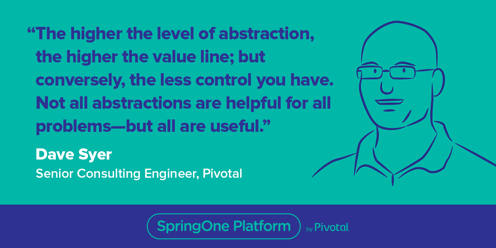
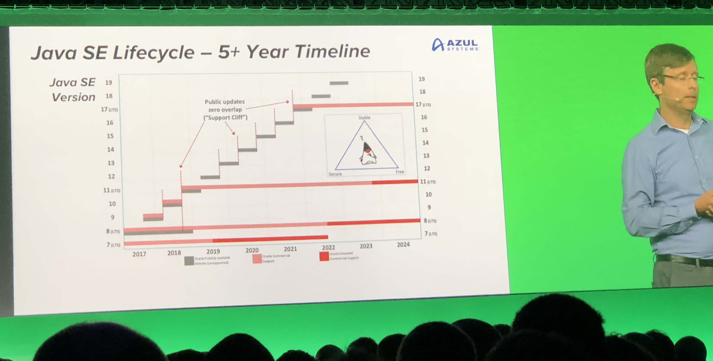
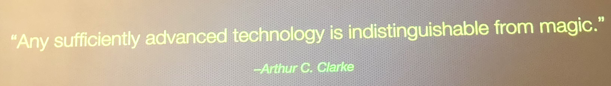

[TOC]

## Summary

The SpringOne Platform was last week and some of us had the amazing opportunity to attend this interesting conference. SpringOne is primary focused on *enabling enterprises to get better at software*. We heard stories of companies and government organizations tell tales of their transformational journeys. The stories always starts with a few black and white photos of how old the organization is and proceed through how they enabled astounding change using industry trends like [Digital Transformation](https://www.cio.com/article/3211428/digital-transformation/what-is-digital-transformation-a-necessary-disruption.html), [DevOps](https://en.wikipedia.org/wiki/DevOps), [Agile Culture](https://pivotal.io/agile), [Lean Principals](https://www.lean.org/WhatsLean/Principles.cfm) and technologies like [Pivotal Could Foundry (PCF)](https://pivotal.io/platform), Pivotal Container Service (PKS), Spring /Java, CI/CD (Concoure) and Agile Engineering. Sound Familiar? Because it is: Pivotal Cloud Foundry basis for what is commonly know in JPMC as Gaia,  Moneta Boot is a JPMC wrapper for Spring Boot, Jules is our Jenkins based CI/CD solution, Agile Engineering is what we are enabling with Dev Modernization we are bring this all together to enable our digital transformation with Connect.

All of this was brought together with *code*. [Java 11](http://openjdk.java.net/projects/jdk/11/) release was announced while we there. Java releases will be increasing in speed. There will be a new release every 6 months. Java 8 Baseline will be supported until 2023+ by many major vendors. Java 11 LTS will also be supported until 2023+. [OpenJDK](https://blogs.oracle.com/java-platform-group/oracle-jdk-releases-for-java-11-and-later) is now where official updates will start to come from instead of Oracle. We are now ready for an event-drive world as the principles of [Reactive](https://www.reactivemanifesto.org/) are now being reality. Spring now fully supports [reactive web apps](https://docs.spring.io/spring/docs/current/spring-framework-reference/web-reactive.html#spring-webflux), [Kafka](https://kafka.apache.org/) is emerging as the center of streaming future and a [new protocol RSocket](http://rsocket.io/) was released. Shift in fundaments include increased abstraction in clouds wide-spread support of Cloud Functions, [Kotlin](https://kotlinlang.org/) is gaining momentum being fully supported by the Spring Framework and a [new type of database](https://www.yugabyte.com/) is emerging providing the best of both worlds NoSQL and SQL.   

## SpringOne Platform 2018 Top Take-Aways

- Complexity has build up in the PCF / PKS ecosystem overtime. New focus is *Reducing Complexity*

- *Cloud Abstractions Trade-offs:* The higher level of abstraction the less things you as a developer need to care about, but less control you have.

  

- Kafka & an Event Driven Future - *All Your Data is Streams of Events*

  

- Java 11 Release was announced!

- Java releases will increasing in speed. There will be a new release every 6 months. Java 8 Baseline will be supported until 2023+ by many major vendors. Java 11 LTS will also be supported until 2023+. OpenJDK is now where updates will start to come from instead of Oracle. 

  

- Start with a *Modular Monolith* decomposed by capability and eject micro-services when required. From the Matt Stone Talk. This validates our approach of not deploying an artifact per service.

  
  

- Chaos Engineering  

- - <https://principlesofchaos.org/>

  - Do science experiments on our system. Hypothesis, Test, Observe  

  - Break Stuff - Do it in production

    

  - Customer Pain will happen. Do thing to minimize impact  

- Securing Spring Functions - You can’t rely on the server-less to destroy everything once the function is done and the container could be reused, so the exploit can carry over to another secure function

- Spring now fully supports *Reactive programming* across the framework and there were many sessions on Reactive Spring. This an asynchronous, non-blocking flow which is much more efficient with resources. It is much more complex to program this way and should be avoided unless you have a use case with an extremely high number of transitions per second. 

- Hierarchies are a org structure of the Industrial Age, while networks are of the Information Age. High Performing organizations at scale have Networks & Hierarchy. 

    

- [Spring Data JDBC](https://spring.io/projects/spring-data-jdbc) just shipped making Spring Data soon possible for Traditional SQL. 

- AirForce Transformation 

  - *"Don’t get distracted by shiny apps. You need to invest in the platform”* 
  - *“Make ship easy"* 

- *"Microsoft has changed and so has Java."* Microsoft is now a huge supporter for Java and Spring. 

- *"Alpha Trend is Artificial Intelligence*. We are in a very early stage" - Paul Daugherty 

- *A new protocol called [Rsocket](http://rsocket.io/) was announced* This provides [Reactive Streams](http://www.reactive-streams.org/) semantics over an asynchronous, binary boundary. It enables  symmetric interaction models via async message passing over a single connection. It also supports connection resumption to allow resuming long-lived streams across different transport connections. This is very new so we can't use it yet since the clients don't exists yet, but this is likely to be very important in the future.

  

- Go from Module Monolithic to Microservices when it makes sense. Eat an Elephant, one bite at a time. 

  

- Framework for data-driven decision making

  

  - Identify a problem. What problem if we continue to ignore will become the biggest pain down the line 
  - Break down and frame the one problem 
  - Measure quantitative to learn qualitatively - something is better then nothing 
  - Iterate & Learn 

- On Kotlin "Magic"

  - "It is not magic, it is technology"

    

- Robobank have a similar technology to "Workstation". Portal Framework, IBM WebSphere. 

- Open Source Community. Need to be involved to shape the direction of the software. Contributing gives you more value then just using it - HBR study 

- Axon Framework

  - Scalable High Performance Applications 

  - Domain Driven Design - find bounded context and build models 

  - CQRS - Patter to divide your application into two parts  

  - Event Sourcing - events but also  the source of the state of your application 

  - Allow developers to focus on the business problem 

  - Reference Architecture - Axon Trader

    

- Look into [JHipster](<https://www.jhipster.tech/>) for full-stack reference implementation inspiration

- YugaByte DB provides a solution 

- We are on an older version Dynatrace in JPMC. <u>Need to follow-up one when we are going to get the latest.</u> 

- We are on old version of Cloud Foundry / Pivotal Cloud Foundry. Our ability to use PCC is blocked by this. <u>Need to follow up on when we are going to have the latest.</u>  

## Other General Thoughts

* All digital transformation journey presentations start with a history lesson (pic of an very old building etc) of the organization and successes in their domain of expertise
* Google Cloud looks very good in general. They also build in many of the SRE capabilities
* Wide variation of presentation quality. Rockstar-level performances to an unrehearsed walk-through of a yaml file. 
* Our organization should present more at tech conferences. It is a good recruiting tool. Will help us shape the direction of the open source software we depend on so much. 
* Our organization should contribute more to open source projects. Contributing gives you more value then just using it - HBR study 
* We should attend more conferences. Not just SpringOne. Example: https://conferences.oreilly.com/velocity
*  Good Presentation Style
  * Each slide light on content and have many slides if required, but avoid dense slides. 
  *  Usage of Animated GIFs in Presentations
  * Live Coding or Deployment Demos
* Twitter still is primary communication tool for the community
