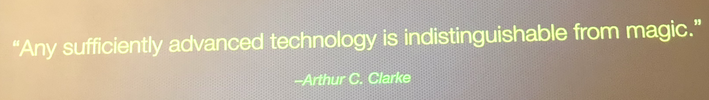
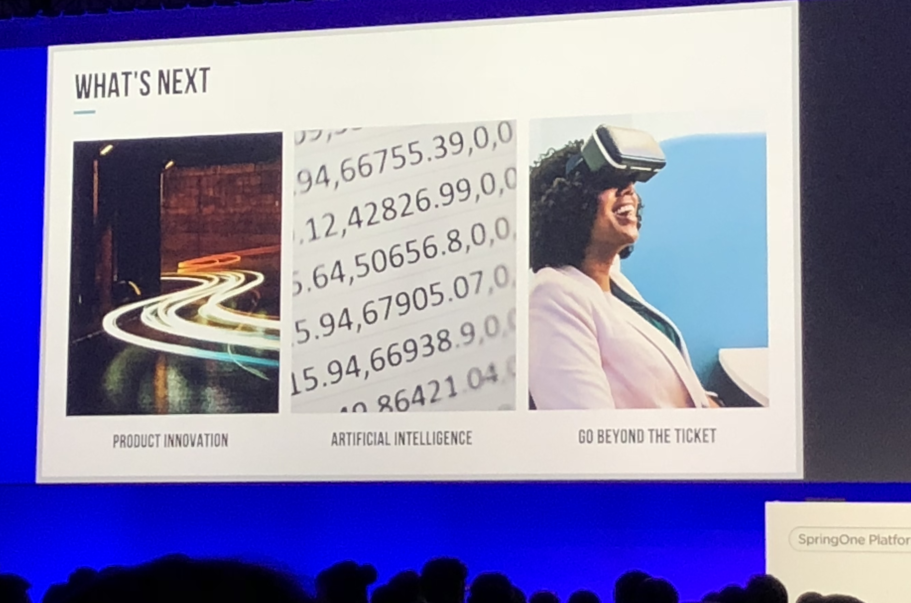

# 

[TOC]
## SpringOne Conference September 25th

### Official Recaps

- <https://content.pivotal.io/blog/springone-platform-2018-day-2-recap>
- <https://spring.io/blog/2016/08/03/springone-platform-2016-recap-day-2>

### Opening on the main stage

- **Run all the things** - Improve style skit

#### PCF PKS Strategy
- Complexity has build up in the PCF / PKS ecosystem overtime. New focus is **Reducing Complexity**
#### Boeing Corp
- *Digital Transformation* as software is power their future  
#### Cloud Abstractions 

- *Trade-Offs*: The higher level of abstraction the less things you as a developer need to care about, but less control you have.  
-  Need to look at the solution to decide which level of abstraction to use.  
-  New Projects 
  - [Spring Cloud Function](https://cloud.spring.io/spring-cloud-function/)
  - [Spring Cloud Kubernetes](<https://github.com/fabric8io/spring-cloud-kubernetes>) 
- Cloud Platform 
  - *Functions*
  - Apps
  - *Data* 
  - *Containers* 

#### Dick’s Sporting Good - *Digital Transformation*
- Ecommerce, Complexities, Volume Spikes
  
  

#### Kafka & and Event-Driven (Confluent)
- **Stream Processing** - All Your Data is Streams of Events
  
- Currently Events exist in your software / database , but it is hidden
- 2 Forms of Events
  1. Triggers - Make an application do some work. (This is what we thing of as queues)
  2. Data - Log of state changes
  - These are equivalent in terms of stream processing
- Reviewed Use Cases - (1) Audi Royal (2) Bank of Canada
- Integration with Spring and PKS

#### Java and Spring Updates
- Java releases will increasing in speed. There will be a new release every 6 months

- **Java 8 Baseline will be supported until 2023+**
- **Java 11 LTS will also be supported until 2023+.** In the near future updates will come from **OpenJDK**. *Will be released today* 
- Java 17 in September 2021. This is next long term support release
- Java 12-16 will be coming out every 6 months
- Spring Framework 5.1 supports both Java 8 and 11. Recommends that if you upgrade to Spring 5.1 use Java 11 if you can
- Spring Framework 5.1 [new features](https://spring.io/blog/2018/09/21/spring-framework-5-1-goes-ga)
- Big Performance Boost for startup time for Spring Boot 2.1
- Spring Framework 5.2 will support Kotlin 1.3

#### Spring on Google Cloud Platform  
- 1st class citizen on GCP 

- On <https://start.spring.io/> and IntelliJ Plug-in 

- GCP works with PCF 

- [*Knative*](<https://cloud.google.com/knative/> ) - building blocks for serverless of Kubernetes. Runs on top of any Kubernetes instance. 

- Serverless for a Developer: More then Just Function as a Service

- Knative Pipeline Demo: No cross-compile. No need for docker locally, faster due to cloud caching, audits  

#### Pivotal Function Service 
- Microservices can be apps or functions 

- Pivotal’s Function as Service

- Demo of deploying functions and wiring them up using riff: <https://github.com/projectriff/riff> 

#### Buildpacks.io
- started with Heroku
- Now available on many platforms including PCF 

### Architecture that bend but don’t break

- Talk by Matt Stine
- What is architecture? 

  - Many definitions 
- Bending but not breaking 
  - Need Stress to get better 
  - [Anti Fragile](<https://www.amazon.com/Antifragile-Things-That-Disorder-Incerto/dp/0812979680)
  - Immune System - needs stress to be get better. Need rot get sick to get antibodies  
  - Ants Swarms - Ants protecting vs water 
- Stresses on Software to make better 
  - Innovation - can we continuously deliver incrementally faster  
  -  Wild Success / System Failure - survive and thrive amidst turbulent conditions 
- How do we measure those qualities? 
  - Innovation 
    - Cycle Time - how long does it take to get a change to production 
    - Inverse Lead Time - how long does it take to get feedback into the dev queue  
    - Trash Ratio: how many of your experiments do you end up discarding? 

  - Resilience  
    - Service Level Objects (SLO) 
      - Books
        - [SRE](https://landing.google.com/sre/book.html)
        - [SRE Workbook](<https://www.amazon.com/Site-Reliability-Workbook-Practical-Implement/dp/1492029505>)
      - Specific Measures like Request Latency 
      - Focus on Distributions instead of Latency 
      - Four Golden Signals: Latency, Traffic, Errors, Saturation 
    - Steady State - external visible, low variation  
      - Netflix: SPS - Successful Streams Starts per Second 
      - A proxy for the important thing that you do 
      - What single indicator can be used to approximate the most important thing the business does 
    - Time to Recovery (TTR) - lead time between discovering an issue to fixing 
- How do we create those qualities 
    - CMU White paper in 1971 
        - [Whitepaper] (https://www.win.tue.nl/~wstomv/edu/2ip30/references/criteria_for_modularization.pdf)
        - Describes Decomposition before OO 

    - Organize by vertical slices - reduce coordination overhead 

    - Capability Decomposition  

    - Domain Driven Design

        

    - Bounded Context - need to ensure we are speaking the same langue  

    - Tactical Design  

    - Aggregates 

    - Hexagonal Architecture

        

    - The Golden Rule = Aggregate <= SizeOf(Module) <= Bounded Context 

    - Monolith —> **Modular Monolith** —> Microservices

        

        

    - **Start with a Modular Monolith  and eject Microservices when required**

- Solutions / Patterns 
  - Timeouts 
  - Retries 
  - Bulkheads - seal compartments so the failures don’t spreads across modular 
  - Circuit Breakers  
  - Release It!  
- Chaos Engineering  
  - [Principles of Chaos](https://principlesofchaos.org/)

  - We are going to science on our system. Hypothesis, Test, Observe  

  - Break Stuff - Do it in production

    

  - Customer Pain will happen. Do thing to minimize impact  

### All You Need to Know to Deploy Applications on Kubernetes

- [Info](https://springoneplatform.io/2018/sessions/all-you-need-to-know-to-deploy-applications-on-kubernetes)

  

- How to Deploy? 
  - Manifest YAML to control everything 
  - Elements
    - Image
    - Container  
    - Configuration 
  - Pods
    - Set of Containers
    - Communication using files 
    - Can use Pods to separate parts of your app 
    - Don’t use pods directly - Use Deployment instead  
    - ReplicaSet - Make sure N pods are running in parallel 
    - StatefulSet - for applications with state 

- How to access?
  - Service
    - Internal - will have static its inside the cluster 
    - External - NodePort or Load Balancer 
  - Readiness Probe - endpoint to know if the pod is ready 

- How to keep it running 

- - Graceful shutdowns 
  - Use livenessProbe to kill unresponsive applications 

- [Try it out](https://cloud.google.com/free/)

### Securing Spring Functions

- By Breaking In (Guy Podjarny, Snyk CEO & CTO)

- Snyk received a series B22M today 

- Overview of Monolith to Contianers to Serverless - more security aspects are moved into the cloud platform 

  

- Serverless Components 
  - Function as a Service 
  - Deployments Model 
  - Programming Model 

- Spring Function - Turn bean into a standalone Cloud Function. Even though you don’t write much code Spring Framework is packaged and deployed 
  - Example of *a Todo application in 222 lines of code, but 5 libs are used directed, 54 indirectly, 460,046 lines of code* 
  - These lines of code are potential surface area were vulnerabilities exists.  

- Hacking Demo
  - Don’t have vulnerabilities libraries  
    - Found a Jackson vulnerabilities 
    - Using exploit to to execute bash and gain OS access 
  - Permission Granularity 
    - Can see more source then what is just in that function 
    - Packaging many functions together because this is convenient 
    - Need to make sure granular policies are use to avoid this 
  - Function Ordering  
    - Private APIs that isn’t exposed, but if you get over the wall then you can access it 
    - Don’t rely on function ordering  
  - Immutability 
    - You can’t rely on the server-less to destroy everything once the function is done and the container could be reused, so the exploit can carry over to another secure function 
  - Worry about all functions 
    - You need to mange many functions to make sure they are all secure.  

### Implementing PII Encryption with PDX Serialization

- Disturbing trends of stolen or lost PII data 1.3 Billion records in 2017  
- Encryption on disk and in memory and on-network. Some search capability retained 
- Installed on Geode Client. Geoservers only deal with encrypted data 
- Utility that added to Geode, but not part of Geode 
- Few Public Methods 
  - encrypt(String PII) 
  - decryptString PII) 
- AutoSerializer can be used 
- - Based on Reflection 
  - Boolean transformFieldValue(field f, type t) - is the field PII? 
  - *Ajay’s Comments - This is very similar to the connect-data-masking utility* 
- [Code Walk-through](<https://github.com/Pivotal-Data-Engineering/geode-pii-encryption> ) of the utility: 
- They have some search capability, but someone in crowd pointed out that it could be cracked using a brute force

### Bootiful Testing 

- By  Josh Long and Mario Gray

  

- <https://github.com/joshlong/bootiful-reactive-microservices>

- <https://github.com/joshlong/bootiful-testing>

- Josh Long just said he just got a new MacBook Pro with 32GB so now he can finally run Chrome and Slack at he same time. ;) 

- Working on Reactive Spring Boot 
  - Asynchronous / Non-Blocking Flow - enabled by Reactive Programming 
  - You can always add more nodes… But we can be more efficient by using reactive programming  
  - Spring now fully supports Reactive Programming across the framework 

- Demo 
  - https://start.spring.io/
  - Use Lombok to remove boilerplate code - <https://projectlombok.org/> 
  - Use a Test Database is is created and destroyed for your test. Used Mongo for this example 
  - Use WebFlex 
  - RestAssured to simulate connection 
  - Testmode must be set EXPLICTED 

## SpringOne Conference September 26th

### Official Recaps

- https://content.pivotal.io/blog/springone-platform-2018-day-3-recap

### Main Stage Part 2

#### Announced Pivotal ACT

- Non-profit organizations. <https://pivotal.io/act> 

#### Spinnaker

- Continuous Deployments in a Multi-Cloud World - <https://www.spinnaker.io/> 
- Inventory of cloud environments 
  - Pipelines  
  - CI and CD have distinct orbits - Spinnaker is brings those together 
  - Pivotal is contributing to Spinnaker 
  - Enables you to use the best cloud for purpose 
  - Some best practices can be generalized across platforms  (Red/Black, Canary, Rollbacks, Health Checking) 
#### Chris Fussell - McCrystal Group 
- [Military Background](https://www.mcchrystalgroup.com/team_member/chris-fussell/)

- [Wrote books](https://www.amazon.com/One-Mission-Leaders-Build-Teams/dp/0735211353)

- Hierarchy vs Network 

  

  - Hierarchy - Industrial Age 

  - Network - Information Age 

  - High Performing Organizations have Networks & Hierarchy 

  - Problem is that silos exists between high performance team

    

    - How to scale up aspects of of high performance teams
    - Tried flatting - problem was the executes could never sleep because everyone has access to them 24/7 
    - Now have both Networks and Hierarchies at the same time 

  - *"It is not enough to do your job really well and then send an email to the next group"*

  - Change where the man effort is. Moving from the Finish to Analyze and Exploit

#### Spring Framework Updates 

- Reactive for the Enterprise 
  - Now 5.0 includes a reactive stack 
  - Many new async features, but how ready are we for these changes? 
  - How can we add value to existing applications
    - Reactive Features in Spring MVC 
    - Async Controllers are handled - use Flux & Mono. Under the hood this is done very efficiently using Netty 

- Spring Data for Traditional SQL

  - [Spring Data JDBC](https://spring.io/projects/spring-data-jdbc) just shipped -
  - But how do you make this async? 
  - New Driver [R2DBC](https://github.com/r2dbc/r2dbc-client)
  - Still needs to be implemented 
  - Spring Data R2DBC just shipped
#### AirForce - Make Ship Easy

- Airforce /DoD is really good at high technology, but is really bad is enterprise technology  
  - DoD is the worlds largest R&D investors 
  - AI in the DoD - Trust and Ethical Considerations 
  - Non-Traditional Partnerships 
- KesselRun 
  - Program inside the AirForce to build software the right way 
  - Build a software company inside the AirForce 
  - "Don’t get distracted by shiny apps, you need to invest in the platform"  
  - https://kesselrun.af.mil/>
  - “Make ship easy" 

#### Microsoft & Java 

- Microsoft has changed and so has Java
  - Been accelerating into becoming a major open source company  
  - Acquired GitHub
- VSCode 
  - Lighter Weight  
  - Many JavaPlugs 
  - IntelliCode AI based suggestions 
- Spring Initializr  
- Open Connecters 
- Azure Functions using Spring Boot 
- Azure Pipelines 
- Azure Dev Spaces - Kubernetes Cluster 
- [Microsoft Lean](http://microsoft.com/lean)
- Free Java Production Support for Free on Azure 

#### Security in the Enterprise - Panel  

- “Governance to Guidance” - SecOps 
- Approver to Enabler  

- Trust and Security is key to the value proposition  
- MasterCard - Security is the #1 prioty  
- Automation is critical to enabling security 
- Look at things from the eyes of a bad actor 

#### Accenture - Paul Daugherty  

- Author of [Human + Machine](https://www.amazon.com/Human-Machine-Reimagining-Work-Age-ebook/dp/B075FCVTRR)

- Moving to an age of increased human potential and empowerment 

- We have a close relationship with technology which has changed the way think... and this is just the start 

- ***Alpha Trend is Artificial Intelligence***. We are in a very early stage 

- Myths 
  - Robots are coming for us 
  - Machines are taking our jobs 
  - Current Approaches will still apply 

- Reimagine Business: Automate—>Re-engineer—>Re-imagine

   

- New approach to Work - Collaborative Intelligence. 
  - Leverage machines for that they are good at and leverage humans for that they are good at. 
  - Example: Trainers.  
  - "Machines will give people superpower" 

- Responsible AI 

  - Need a Code-of-Conduct around AI 

- Challenges  
  - Sklls & Learning 
  - Data Veracity 
  - No Finish Line 

- Renaissance of Custom 

#### Future of Reactive Architecture 

- Started with TCP in 1974. Is Bidirectional and has Flow Control  
- HTTP in 1989. Request/Reply. Good for serving documents,  
  - Puts burden on client for dealing with error handling  
  - Does Reactive solve the problem? - Still has the issues ion HTTP 

  
- **Rsocket - new protocol** 
  - <http://rsocket.io/>
  - <https://github.com/rsocket/rsocket>
  - 4 defined interactions models 
  - Transport Agnostic - works over web sockets or tcp... 
  - Works across the chain through layers 
  - Implemented across programming laugues  
  - Example - live query - graphQL 
  - Cool Feature - Subscription resumption - continue to stream where you left off 
  - Facebook using this heavy - lead to huge savings and improvements 

### Rethinking Legacy and Monolithic 

- Everyone wants to Go Micro-services 

- What is Legacy? - “Legacy makes money, otherwise it would have been unplugged" 

- Nothing wrong with a well modularized Microservices. Less network impact vs. Microservices  

- There is an issue with Big Ball of Mud 

- Anemic Domain Model 

  - Need a fluid way of setting attributes 

- What is a Microservices? 100 LoC? 

- Hard to know dependencies?   

- Many small Microservices will be expensive at the sametime 

- Bounded Context instead 

- Use Fluent Model  

- Go from Module Monolithic to Microservices when it makes sense 

- Eat an Elephant - One bite at a time

  

- Strangler Patter 

- - works, but it s hard 
  - Need to generate events back and forth as you exists in both worlds 
  - Generating events from a legacy database <https://debezium.io/>

- Restructured Pattern 

- Reactive Rework

### Data Driven Decision Making

- Velocity is important. But it is also very important that you are moving In correct direction 

- Goal: Take a problem, Break it Down Analyze etc... 

- Quantitative and Qualitative  

- Stories
  - Known Knows 
  - Known Unknown
    - Assess what you are trying to learn  
    - What is an “active users”?
      - Two types of active users 
        1. Frequent Small Requests
        2. Infrequent Large Requests (stealing data) 
  - Unknown Unknowns - learning 
    - How important for our success? 
    - Where are we know? 

- Framework for data-driven

  

  - Identify a problem. What problem if we continue to ignore will become the biggest pain down the line 
  - Break down and frame the one problem 
  - Measure quantitative to learn qualitatively - something is better then nothing 
  - Iterate & Learn 

### Spring Boot 2.0 for Web Application w/ WebFlux

- [Migration from 1.x](https://github.com/spring-projects/spring-boot/wiki/Spring-Boot-2.0-Migration-Guide)
- Update dependencies  
- Update Security  
- Getting Started with Reactive features 
- - Inject WebClient Builder  
  - Use [Mono and Flux](https://spring.io/blog/2016/04/19/understanding-reactive-types)
  - Use `Mono<List>` if you need the entire result set in one go 
  - `Mono.zip` will trigger multiple operations at the same time 

### Visualizing Metrics

- [Visualizer](https://github.com/Netflix/vizceral)
- Data Sources: app-metrics-nozzel 
- How to Classify Errors - need to manage signal to noise ratio 
- Use Indicator for Visualizations 
- This is an [open source project](https://github.com/dav1dc-pcf/vizceral-app-metrics-ui) - they are looking for contributors 
- Complete to monitoring - not a replacement 
- Inspiration for building your own visualization tools

### Enterprise Systems Built with Microservices

* By Dalia Borker JPMC 

- Move from Monolith to Microservices  
- How do you handle failiures? 
- - Just decomposing alone doesn’t result in more resiliency  
  - Consumer Contracts 
  - Retries & Idempotent APIs 
  - Promises and Fallback 
- Circuit Breaker Pattern to stop cascading failures that could bring an entire system down 
- Caching Framework on PCF 
- - Redis Caching 
  - PCC - good for update systems 
  - Hazelcast 
- Use Case 
- - High Volume 
  - Can use cache as a back up 

### Six Steps to SLOs
- We all have systems we care about, we all want to know that the are up and we don’t want burnout fatigue  

- Terms 

  - SLI - measure of good enough 
  - SLO - target for good interaction. Difference between good and bad 
  - SLA - contract between service provider and end user 

- Step 1: Think like a User / PM 

  - What does working mean 
  - How to measure? 

- Step 2: Identify you users 

- Step 3: Identify user journeys - How do they interact with with my service 

- Step 4: Track users journey success with SLIs - write this out in English first 

  - Measuring Reliability
    - Option 1: Availability = good minutes / total minutes () 
    - Option 2: Availability = good interactions / total interactions () 

- Step 5: Pick SLOs - pick a lower number to start - ie 90% of Pages Loads within 1 sec

  - 100% is the wrong target, because you’ll always miss this 
  - Error Budgets - ie the numbers of 9s 

- Step 6a: Operational Shift - Update Monitoring  

  - Switch from SLI based monitoring to SLO threshold 

- Step 6b: Operational Shift - Below SLO

  - Change Behaviors
    - Fewer releases 
    - Do Reliability Features 
    - Pay down Tech Debt 

  

- Google Built this into Google Cloud - [Stackdriver SLO monitoring](https://cloud.google.com/stackdriver)

- Books

  - Worth Buying: [SRE Workbook](https://www.amazon.com/Site-Reliability-Workbook-Practical-Implement/dp/1492029505)
  - Free, but related to google: [SRE](https://landing.google.com/sre/)

- Q&A

  - If you are over performance - take some some takedown because you are acclimating using to higher response time, Time to use something like chaos engineering.  

### Path to Production: Value Stream Mapping in a DevOps World

- Industry Trends

  - Digtal Transformation 
  - DevOps 
  - Agile Culture 
  - Lean Principals 

- Release Velocity is the most important change for your team - Many examples 

  

- Value Stream - Sequence of activities to get into production  

- Value Stream Mapping - What are the steps 

- Quality is important - rework is not desired 

- Value Stream —> Process —> Steps 

- Goal: Lead Time = Process Time 

- Value Add Steps - must d 

- Lessons learns from doing a mapping exercise   

  - Need to create a safe space  
  - Need to define goals 

- Who to include

  - Software, Support, Operations 
  - Operations will be automated 

- Understanding your desired outcome - are you delivering faster? 

- How fast can you delivery your application without change? 

- Enterprises that highly regulated often have NO building into the culture 

- Reference 

  - [Value Stream Mapping](https://www.amazon.com/Value-Stream-Mapping-Organizational-Transformation/dp/0071828915)
  - [Use Value Stream Mapping to Guide Your Software-Driven Future](https://content.pivotal.io/blog/use-value-stream-mapping-to-guide-your-software-driven-future)
  - [Crossing the Value Stream: Improving Development with Pivotal and Cloud Foundry](https://content.pivotal.io/white-papers/crossing-the-value-stream-improving-development-with-pivotal-and-cloud-foundry?lipi=urn%3Ali%3Apage%3Ad_flagship3_feed%3BSgPswNrLTOGMyzf0b7PR8Q%3D%3D)

### Springing into Kotlin: How to Make the Magic Even More Magical 

- By @mkheck 

- "It is not magic, it is technology"

  

- What is Kotlin? It is Java++ 

- Let’s Code!

  - You can start with a Java App and move pieces of it to Kotlin 
  - Change .java to .kt - now you will have errors 
  - Remove semicolmns 
  - Don’t need public in front of class 
  - Functions are fun  - “Everything is fun is Kotlin" 
  - Not NULL assertion operator 
  - [github](https://github.com/mkheck/spring-into-kotlin)

## SpringOne Conference September 27th

### Official Recaps

- https://content.pivotal.io/blog/springone-platform-2018-day-4-recap

### Main Stage Part 3

#### Robobank 

- International Bank from the Netherlands 
- Bank founded before computers existed, but has a long history of being a leader in technology 
- They have a similar technology stack our legacy in JPMC:  
  - Portal Framework 
  - IBM WebSphere

  
- Generally, this has been very successfully, but it is time to move on because... 
  - The technology is aging 
  - DevOps 
  - Scalability Limits 
- Looked for a new platform for 2 years and ended up selected PCF due to simplicity  
- How to migrate? 
- The technology is awesome... But Microservices aren’t so easy 
- People!
  - A couple thousand of people 
  - Hard to get everyone in bank to adopt 
- Now growning fast 

#### Stubhub 
- (Matt Swain, CTO) 

- Mission: to bring the joy of live to fan globally 

- World’s largest event market place 

- 1,000+ employees across the global 

- Stubhub is platform also supporting Buyers, but also Developers and Enterprises 

- Speed & Innovation

   

  - Cloud - PCF 
  - CD/CI - Concoure 
  - Spring / Java 
  - Agile 

- What’s Next

  

  - Product Innovation 
  - Artificial Intelligence  
  - Go Beyond the Ticket 

#### Open Source Updates 

- Community - shape the direction of the software. Contributing gives you more value then just using it - HBR study 
- Spring - #1 most forked and #5 by stars on GitHub 
- Cloud Foundry : +3,000 contributors 
- RabbitMQ 
- Geode 
- Greenplum - Based on postgre. Compteting products are closed  
- Reactor  - 800% increase on maven downloads 
- Knative - new

#### Solstice 

- Helps Enterprises 

- Patterns

  

  - Financial Services 
  - AgTech 
  - Manufacturing 

- Frameworks
  - Spring 
  - Axon Framework

#### Axon Framework 

- Scalable High Performance Applications 

- Domain Driven Design - find bounded context and build models 

- CQRS - Patter to divide your application into two parts  

- Event Sourcing - events but also  the source of the state of your application 

- Allow developers to focus on the business problem 

- Reference Architecture - Axon Trader

  

  

  - http://axontrader.cfapps.io/
  - <https://github.com/AxonFramework/Axon-trader>

#### DBS 

- Live more, Bank Less

  

- Biggest Bank in Singapore and Biggest in  

- Mission to. Become a 22,000 person startup 

- Biggest Competitor are Big Technology Companies  

- Digital Transformation journey in 4 years 

- Use PCF - have had. 0 down time since they started using this 

- Transformed the way they hire top tech talent
  - Start with hacker rank <https://www.hackerrank.com/> 
  - Hire Talent from many different industries 
  - Use hackathons - like JPMC 
  - Hired 50 devs in 2 days in 2017 
  - Hired 130 devs 1 day in 2018 

#### Batch Processing 

- As workloads move the cloud batch are following 
- Found a project on GitHub were Cobol it being run serves 😛 
- Security - <https://evilmainframe.com/> 
- Reduce Costs 
- What does batch on a modern platform look like 
  - Spring Boot / Spring Batch 

  - Spring Cloud Task 

  - Inside a Container 

  - Can many containers 

  - Spring Cloud Data Flow

    

### Full Stack Reactive

- By @mraible - works at @oktadev

- [Blog Post](https://developer.okta.com/blog/2018/09/25/spring-webflux-websockets-react)

- What is reactive programming? 
  - Asynchronous IO 
  - Showed how to do Asynchronous in pure Java without a framework 
  - Asynchronous is way more complicated, but it is also more efficient 
  - [Reactive Streams](http://www.reactive-streams.org/)
  - Spring WebFlux - don’t use this unless if you are building something with extremely high throughoput 

- Demo.- Start: Monogo-DB-Reactive, web-flux 

- ES6, ES7 and TypeScript

   

- [Learning React](https://vimeo.com/213710634)

  

- 1.2 million lines of JS after create react app 

- JHipster 

  

- - <https://www.jhipster.tech/>
  - <http://www.jhipster-book.com/#!/>

- [Tool for writing books](https://github.com/mraible/infoq-mini-book)

- Progressive Web Apps 

### YugaByte DB

- What is YugaByte DB?

  - Transactions, high-performance, planet-scale 

- Started a solution at facebook - how to scale to a billion users
  - Dozens Petabytes 
  - Billions of IOPS 
  - Scale out frequently 
  - Zero Downtown 

- How to achieve scale
  - Geo-distrubuted DC's 
  - Containers for applications 
  - Microservices based design  

- All about developer agility - move faster

   

- Data Tier Transformation 

  

- YugaByte DB

  - Cloud-Native 
  - Planet-Scale 
  - Tranactions 

- Core DB Features
  - SQL  
  - NoSQL 

- Demo of YugaByte running on PKS

  - They have it recorded here <https://vimeo.com/291765932> 

- Demo of a Market Place App with a large amount of data

  

  - https://github.com/kronos-yugabyte/retail-marketplace
  - Instead of disturbing a cache, the DB is distributed 